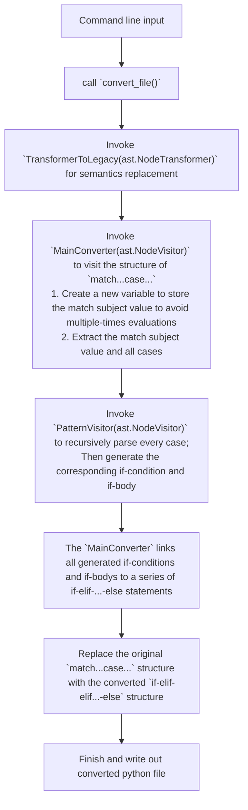

PyVerCompat: Semantic Features Conversion Tool for Pure-Python Code or Projects
===============================================================================


## Introduction

PyVerCompat is a tool to convert (downgrading) Python `3.10+` codes' semantic features to Python `<=3.9` code. This tool is designed to make it easier for heavy users of new Python language features to deploy code on older environments with minimal pain.


> **NOTICE#1**: This tool must run on `Python>=3.10` to parse `match...case...` semantics.

> **NOTICE#2**: In the current stage, `PyVerCompat` does not support converting APIs to older version. So please make sure your library is using the stable APIs from both standard and third-party libraries. In the future, we will implement the automatic conversions towards "typings" module.

### Major Functionalities

- Converting single Python3.10+ `.py` file
- Packing up one Python project into multiple wheels that compatible with both older or newer versions.

### Supported Semantic Features

- Pattern-Matching (`match...case...`): Supported now
  - Currently the magic property `__match_args__` is not supported.
- Walrus Operator: Developing...

## The Workflow of PyVerCompat

# Usage

## Convert Single File

Go to the path `demos/wheels-packup`, the file `match_case_demo.py` features `match-case` semantic:

```python
# match_case_demo.py
def f(a):
    match a:
        case 1:
            return
        case [1, x]:
            return x
        case {"a": 1}:
            return a
        case _:
            pass
```

Then run:

```sh
python -m pyvercompat convert-file -i match_case_demo.py -o converted_to_if_else.py --encoding utf8 
```

File `converted_to_if_else.py` will be generated, and its content is shown in the code block below ↓. The original match...case... semantics was converted automatically to a series of `if...elif...else` statements.

```python
# converted_to_if_else.py
def f(a):
    if a == 1:
        return
    elif len(a) == 2 and a[0] == 1 and True:
        x = a[1]
        return x
    elif 'a' in a and a['a'] == 1:
        return a
    else:
        pass
```

## Build wheels for Lower Python versions

PyVerCompat can build wheels for lower Python versions on Python>=3.10.
Currently 3.8 and 3.9 are supported.

For example, go to the path `demos/wheels-packup`, there is a small python project with
heavy usage on match-case semantics, especially in `UppaalLTLParser/ltl.py`

Run the command below to packup the project:

> **NOTICE**: `pyvercompat create-wheel` command must be launched under the project root that have a `setup.py` or `pyproject.toml`.

```sh
python -m pyvercompat create-wheel --tag-types 38-39,310+ --wheel-src .\UppaalLTLParser\,.\README.md,.\setup.py --ignored-files .pyc
```

- **--tag-types**: The types of python version tag on the wheel's filename to be generated. Currently supporting:
  - `38-39` : Python 3.8 and 3.9, indicating python version tag `py38.py39`
  - `310+`  :Python >=3.10, indicating python version tag `py310.py311.py312.py313`(Will be changed if a newer version of python is released)

- **--wheel-src**: The source files or directories to be packed up.
- **--ignored-files**: The files to be ignored when packing up.

Then just check the generated wheel file in `pyvercompat-dist` directory, you will find the two wheels below:

```shell
pyvercompat-dist
|
|--UppaalLTLParser-0.1.0-py310.py311.py312.py313-none-any.whl
|--UppaalLTLParser-0.1.0-py38.py39-none-any.whl
```

> **NOTICE1**: If you are sure that your project has no walrus operator like `print(a:=b)`, you can manually change the package name `UppaalLTLParser-0.1.0-py38.py39-none-any.whll` to `UppaalLTLParser-0.1.0-py37.py38.py39-none-any.whl` to make it compatible with Python 3.7.

> **NOTICE2**: Though the wheel for newer Python version is tagged `py310.py311.py312.py313`, for  interpreter versions, eg, `3.14`, the wheel could also be used because pip regards `py<VERSION>` tags as compatible with the Python Interpreter >=`VERSION`, according to [Thomas Kluyver's post](https://discuss.python.org/t/python-tags-specific-version-of-interpreter-or-minimum-version/7831)

## Contributing to This Project

### Reporting Bugs or Providing Suggestions

Feel free to [open an issue](https://github.com/hzyrc6011/pyvercompat/issues) if you have any questions or suggestions.

### Help Extending This Project

Please refer to [Developing Documentations](#636562598) to understand this project, and feel free to [submit a new pull request](https://github.com/hzyrc6011/pyvercompat/pulls)!

## Developing Documentations

<div id="636562598"></div>

### Project Structure

The structure of this project is shown below:

```python
├─demos
│  ├─convert_single_file # Demo project to convert single file
│  └─wheels-packup # Demo project to packup wheels
├─docs
├─py-tests
│  ├─match_case_conversion # Test semantic conversion
│  └─packup # Test packing up wheel package
└─pyvercompat # Main directory for the package
   ├─converter.py # Semantic converters
   ├─utils.py     # Some auxiliary functions for various purposes
   ├─wheel_packer.py # Wheel builder and packer
   ├─__init__.py 
   └─__main__.py # Containing the client
```

### Semantic Conversion Procedure

The major functionality of this tool is semantic conversion based on the built-in module `ast`. We provide the conversion procedure of `match...case...` as an example, the conversion procedure is implemented in [pyvercompat/converter.py](pyvercompat/converter.py), and the conversion process is shown in the flowchart below:


