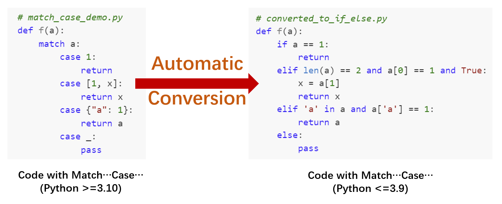
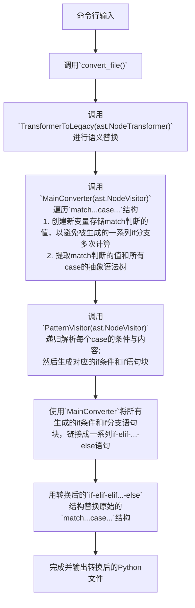

PyVerCompat: 用于纯Python代码或项目的语义特性转换工具
================================================================================


## 引言

PyVerCompat 是一个工具，用于将 Python `3.10+` 代码的语义特性转换为 Python `<=3.9` 的代码。此工具旨在使大量使用新 Python 语言特性的用户能够更轻松地在旧环境中部署代码。



> **注意#1**：此工具必须在 `Python>=3.10` 上运行以解析 `match...case...` 语义。

> **注意#2**：在当前阶段，`PyVerCompat` 不支持将 API 转换为旧版本。因此，请确保您的库使用了来自标准库和第三方库的稳定 API。未来，我们将实现针对 "typings" 模块的自动转换。

### 主要功能

- 转换单个 Python3.10+ `.py` 文件为较低版本
- 将一个 Python 项目打包成多个轮子（wheels），分别为最新版本及兼容较旧版本。

### 支持的语义特性

- 模式匹配 (`match...case...`)：现已支持
  - 目前不支持魔法属性 `__match_args__`。
- 海象运算符：开发中...

## PyVerCompat 的工作流程

# 使用方法

```zh
git clone https://gitee.com/mole-h-6011/pyvercompat
cd pyvercompat
```

## 转换单个文件

在路径 `demos/wheels-packup`下查看此示例。文件 `match_case_demo.py` 中含有一个 `match-case` 语法：
```python
# match_case_demo.py
def f(a):
    match a:
        case 1:
            return
        case [1, x]:
            return x
        case {"a": 1}:
            return a
        case _:
            pass
```

然后运行：

```sh
python -m pyvercompat convert-file -i match_case_demo.py -o converted_to_if_else.py --encoding utf8 
```

将生成文件 converted_to_if_else.py，其内容如下面的代码块所示，原始的 match...case... 语义被自动转换为一系列的 if...elif...else 语句。

```python
# converted_to_if_else.py
def f(a):
    if a == 1:
        return
    elif len(a) == 2 and a[0] == 1 and True:
        x = a[1]
        return x
    elif 'a' in a and a['a'] == 1:
        return a
    else:
        pass
```

## 构建适用于较低Python解释器版本的Wheel包

PyVerCompat可以在Python>=3.10的环境中为较低的Python版本构建wheel。目前支持3.8和3.9。

例如，进入路径`demos/wheels-packup`，那里有一个小的Python项目，大量使用了match-case语义，特别是在`UppaalLTLParser/ltl.py`中。

运行以下命令来打包项目：

**注意：** `pyvercompat create-wheel`命令必须在包含`setup.py`或`pyproject.toml`的项目根目录下运行。

```bash
python -m pyvercompat create-wheel --tag-types 38-39,310+ --wheel-src .\UppaalLTLParser\,.\README.md,.\setup.py --ignored-files .pyc
```

`--tag-types`: 生成的wheel文件名上的Python版本标签类型。目前支持：

- `38-39`：Python 3.8和3.9，表示python版本标签`py38.py39`
- `310+`：Python >=3.10，表示python版本标签`py310.py311.py312.py313`（如果有新的Python版本发布，将会改变）

`--wheel-src`：要打包的源文件或目录。

`--ignored-files`：打包时要忽略的文件。

然后检查`pyvercompat-dist`目录中生成的wheel文件，你会找到以下两个wheel：

```
pyvercompat-dist
|
|--UppaalLTLParser-0.1.0-py310.py311.py312.py313-none-any.whl
|--UppaalLTLParser-0.1.0-py38.py39-none-any.whl
```

> **注意#1**：如果你确定你的项目中没有像`print(a:=b)`这样的walrus运算符，你可以手动将包名`UppaalLTLParser-0.1.0-py38.py39-none-any.whl`改为`UppaalLTLParser-0.1.0-py37.py38.py39-none-any.whl`，使其与Python 3.7兼容。

> **注意#2**：虽然新Python版本的wheel标记为`py310.py311.py312.py313`，但对于解释器版本（如3.14），该wheel也可以使用，因为根据Thomas Kluyver的帖子，pip认为`py<VERSION>`标签与Python解释器>=VERSION兼容。

## 如何帮助此项目成长

### 报告错误或提供建议

如果你有任何问题或建议，欢迎[创建问题](https://github.com/hzyrc6011/pyvercompat/issues)。

### 帮助扩展项目

请参考[开发文档](#636562598)来理解本项目，并随时[提交新的拉取请求](https://github.com/hzyrc6011/pyvercompat/pulls)！


<div id="636562598"></div>

## 开发文档


### 项目结构

该项目的结构如下：

```python
├─demos
│  ├─convert_single_file # 单文件转换示例项目
│  └─wheels-packup # wheel包打包示例项目
├─docs
├─py-tests
│  ├─match_case_conversion # 语义转换测试
│  └─packup # wheel包打包测试
└─pyvercompat # 主要的包目录
   ├─converter.py # 语义转换器
   ├─utils.py     # 用于各种目的的辅助函数
   ├─wheel_packer.py # wheel构建和打包器
   ├─__init__.py 
   └─__main__.py # 包含客户端
```

### 语义转换流程

该工具的主要功能是基于内置模块`ast`的语义转换。我们以`match...case...`的转换为例，代码在[pyvercompat/converter.py](pyvercompat/converter.py)中实现，转换流程如下所示：



这个流程图描述了从命令行输入到转换并输出Python文件的整个过程。
